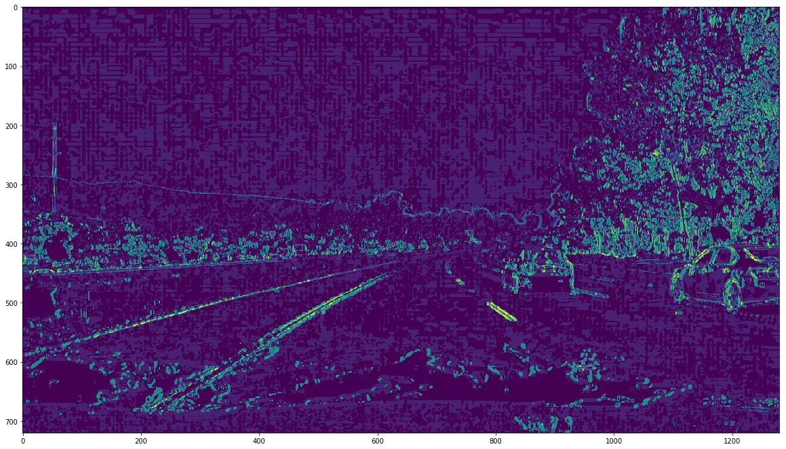
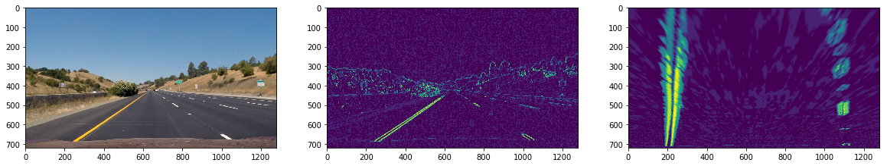
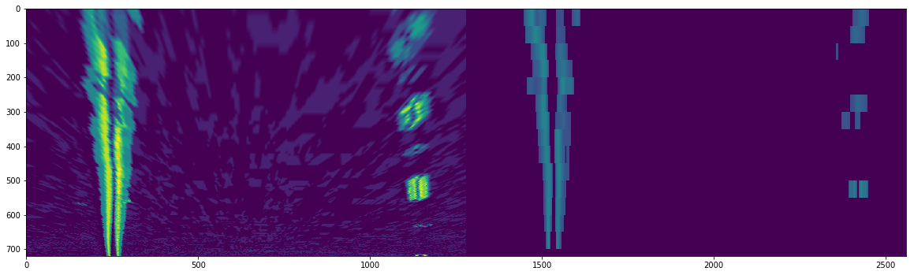
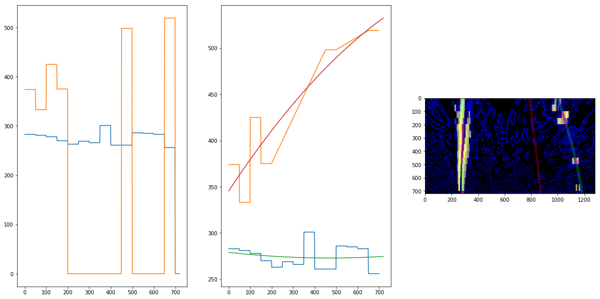
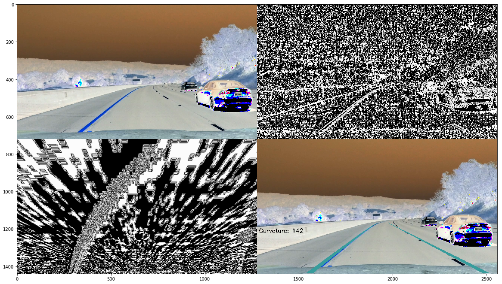

# Advanced (curved) line tracking - Peter Tempfli

Please see the the final video here:

[](https://www.youtube.com/watch?v=Xi9nykQUFHE)

Please see the [jupyter notebook here](./adv_lane_finding.ipynb).

## Distortion correction

I'm using the following function, using the previously _mtx_ coefficients.

```
def undistort(image):
    return cv2.undistort(image, mtx, dist, None, mtx)
```


## Gradient (edge) detection

I'm using 3 gradient finding algorithm: sobel on y-axe, sobel on y-axe and sobel to the direction of the gradient (arctan). Thresholding parameters are found by hand.

After that, I'm combining them the following way:

1. Taking x, y and direction sobel's of the L channel of the HLS color space
2. Taking x and y sobels of the black and with image
3. Adding up these values, so the most activated points are getting the higher values.




```
def gradient_transform_wrapper(image):
    img = np.copy(image)
    
    l_chan = cv2.cvtColor(img, cv2.COLOR_BGR2HLS)[:,:,2]
    gx = gradient_transform_x(l_chan, ksize = 7, thresh=(30, 150))
    gy = gradient_transform_y(l_chan, ksize = 7, thresh=(30, 150))
    gd = gradient_transform_direction(l_chan, ksize=7, thresh=(1.5,2.3)) 
    
    combo_hls = np.zeros(l_chan.shape)
    combo_hls[(gx == 1)] += 10
    combo_hls[(gx == 1)] += 10
    
    combo_hls[(gd == 1)] += 4
    
    bw = cv2.cvtColor(img, cv2.COLOR_BGR2GRAY)
    gx = gradient_transform_x(bw, ksize = 7, thresh=(30, 150))
    gy = gradient_transform_y(bw, ksize = 7, thresh=(70, 150))
    combo_bw = np.zeros(bw.shape)
    
    combo_hls[(gy == 1)] +=10
    combo_hls[(gx == 1)] +=10
    return combo_hls
    
    return combo
```

## Birds-eye view

The transform is done using the _cv2.getPerspectiveTransform_ method. Parameters found manually.



## Sliding window histogram transform

This function is trying to filter out noise.



```
def hist_slide(data, wsize=50, thresh=0.5):
    out = np.zeros(data.shape)
    
    i = 0
    while i+wsize < data.shape[0]:
        start_y = i
        end_y = i + wsize
        
        window_hist = np.sum(data[start_y:end_y], axis=0)
        window_hist = window_hist / np.max(window_hist)

        window_hist[window_hist < thresh] = 0
        out[start_y:end_y] = window_hist
        
        i+= wsize
    return out
```

It loops from up to down over the rows and sums up column values (np.sum). After normalization, it applyes a threshold and returning the activated points.

## Polynominal fit

The _fit_line_on_hist_ function takes output from the _hist_slide_ function and returns polynominal coefficients. It assumes that the data is already split to left and right side, as well as transposed.

1. As the data is transposed, so the y-axe shows the distance from the left side of the display, the y-coordinates of the lane-line is coordinated by getting the larges value : `y = np.argmax(p, axis=0)`
2. Zero values as filtered out.
3. Values which are more than 4*STD from the mean, are also filtered out.
4. Still very extreme jumps in the data (more that 300 pixels between 2 points) are also filtered out.
This is demonstrated on the plots: first plot shows the unfiltered data, while second shows the filtered data.
5. `np.polyfit` is used on the filtered points.




```
def fit_line_on_hist(p, degree=2, vis=False, plot=False, top_crop=0):
    y = np.argmax(p, axis=0)
    x = np.arange(len(y))
    y_mean = np.mean(y)
    y_std = np.std(y)
    
    xx = []
    yy = []
    for i in range(top_crop, len(y)-top_crop):
        if y[i] != 0 and abs(y[i] - y_mean) < y_std*4:
            xx.append(x[i])
            yy.append(y[i])

    xx = np.array(xx)
    yy = np.array(yy)
    
    # getting the average difference between the curve points
    avg_dist = np.abs(np.ediff1d(yy[np.where(yy != 0)]))
    avg_dist = np.mean(avg_dist[np.where(avg_dist != 0)])
    #print('avg_dist', avg_dist)
    
    # filtering the too large distances
    xxx = []
    yyy = []
    xx = xx[::-1]
    yy = yy[::-1]
    last_y = yy[0]
    for i in range(len(xx)):
        if abs(last_y - yy[i]) > 300 : continue
        last_y = yy[i]
        xxx.append(xx[i])
        yyy.append(yy[i])
    
    xx = np.array(xxx[::-1])
    yy = np.array(yyy[::-1])
    
    if plot:
        plt.subplot(1,3,1)
        plt.plot(x,y)
        plt.subplot(1,3,2)
        plt.plot(xx,yy)
            
    coeffs = np.polyfit(xx, yy, degree)
        
    return coeffs
```

## Steps of the pipeline


## Problems
