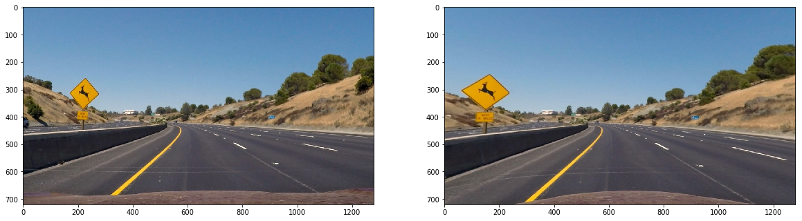

# Advanced (curved) line tracking - Peter Tempfli

Please see the the final video here:

[](https://www.youtube.com/watch?v=Xi9nykQUFHE)

Please see the [jupyter notebook here](./adv_lane_finding.ipynb).

## Distortion correction

I'm using the following function, using the previously _mtx_ coefficients.

```
def undistort(image):
    return cv2.undistort(image, mtx, dist, None, mtx)
```


## Gradient (edge) detection

I'm using 3 gradient finding algorithm: sobel on y-axe, sobel on y-axe and sobel to the direction of the gradient (arctan). Thresholding parameters are found by hand.

After that, I'm combining them the following way:

1. Taking x, y and direction sobel's of the L channel of the HLS color space
2. Taking x and y sobels of the black and with image
3. Adding up these values, so the most activated points are getting the higher values.


```
def gradient_transform_wrapper(image):
    img = np.copy(image)
    
    l_chan = cv2.cvtColor(img, cv2.COLOR_BGR2HLS)[:,:,2]
    gx = gradient_transform_x(l_chan, ksize = 7, thresh=(30, 150))
    gy = gradient_transform_y(l_chan, ksize = 7, thresh=(30, 150))
    gd = gradient_transform_direction(l_chan, ksize=7, thresh=(1.5,2.3)) 
    
    combo_hls = np.zeros(l_chan.shape)
    combo_hls[(gx == 1)] += 10
    combo_hls[(gx == 1)] += 10
    
    combo_hls[(gd == 1)] += 4
    
    bw = cv2.cvtColor(img, cv2.COLOR_BGR2GRAY)
    gx = gradient_transform_x(bw, ksize = 7, thresh=(30, 150))
    gy = gradient_transform_y(bw, ksize = 7, thresh=(70, 150))
    combo_bw = np.zeros(bw.shape)
    
    combo_hls[(gy == 1)] +=10
    combo_hls[(gx == 1)] +=10
    return combo_hls
    
    return combo
```

## Birds-eye view

The transform is done using the _cv2.getPerspectiveTransform_ method. Parameters found manually.


